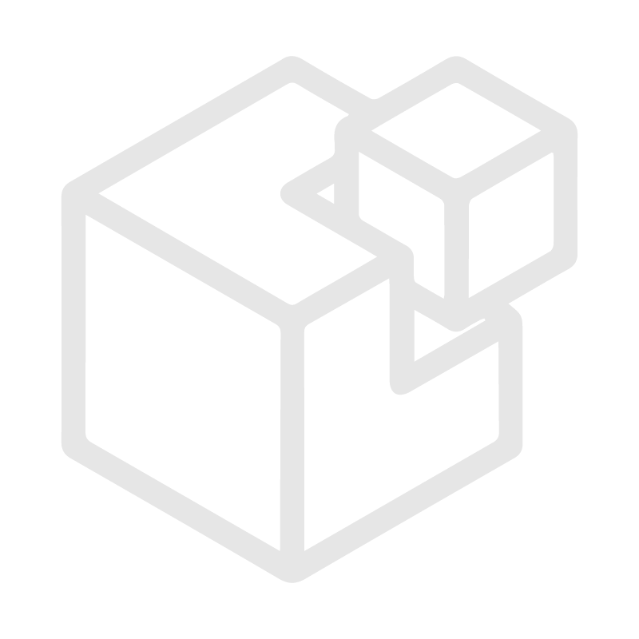
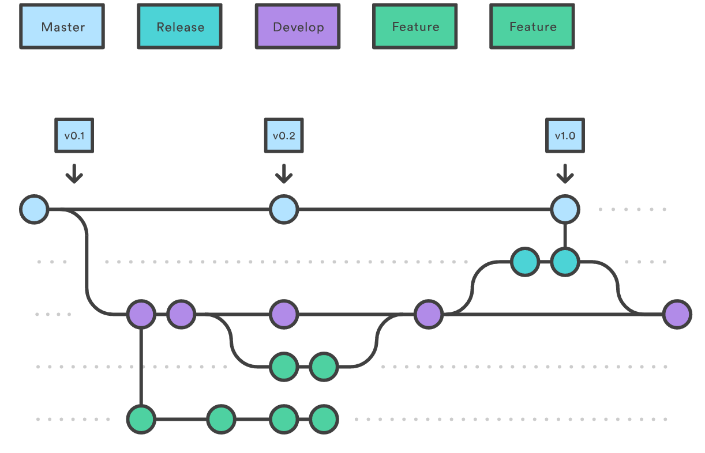
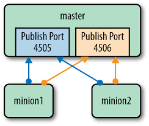

<!-- $width: 1300 -->
<!-- $height: 1000 -->
<!-- *page_number: false -->
<!-- $theme: default -->
<!-- footer: Les Jeudis du Libre -->
<!-- prerender: true -->
<!-- editor: Marp 0.0.10 --> 


# La gestion de configuration et de cloud

_Les Jeudis du Libre, Mons_
_20/04/2017_

**Sébastien Wains**

 sebastien.wains@gmail.com
 @sebw 
 @SebastienWains

---



<!-- page_number: true -->

# Qui suis-je ?

Administrateur systèmes chez ETNIC

Gradué de l'Institut Supérieur Economique (ISE) de Mons en... comptabilité et gestion

Blogger [https://blog.wains.be](https://blog.wains.be)

Red Hat Certified Engineer

Contribution à plusieurs projets Open Source

---


# Que permet Salt ?

- exécution à distance asynchrone (sa fonction première au début du projet)
- gestion de configuration centralisée
- récupération d'informations
- provisioning VM et cloud
- orchestration
- monitoring
- auto-scaling
- compliance
- flexibilité et extensibilité

---


# Les avantages de la gestion de configuration :chart_with_upwards_trend: 

- efficacité
- stabilité
- contrôle
- suivi du changement
- documentation
- visibilité
- compliance
- ...

---


<h1><p style="text-align: center;">Combien de serveurs pour commencer ?</p>

---


<center></center>

---

# Pourquoi Salt ?


#### Premiers tests en mai 2013

- gestion de configuration de services de base pour commencer (SSH, SMTP, NTP)
- remote execution (`yum upgrade x`, `uptime`)
- récupération d'informations sur le parc (CPU, mémoire, version OS)
- code dans un dépôt SVN
- test du code via `test=True` avant de pousser en production

---


# Les avantages (en 2013) (1/2)

- Orchestration "event-driven" via un `event bus` sur le master
- Haute disponibilité du rôle `salt-master` possible
- Ecrit en Python avec des possibilités d'extensions intéressantes
- Configuration YAML et templates Jinja (mais attention à la syntaxe !)
- `salt-syndic` pour les grosses infrastructures ("proxy")
- Mode masterless possible (code sur le serveur géré "minion")

---


# Les avantages (en 2013) (2/2)

- Mode push ET pull
- Début d'un support de Windows
- Salt Cloud pour instancier le node avant de gérer sa configuration
- Gestion de configuration, exécution à distance, récupération d'informations dans un seul package
- Simple ! De l'installation à un premier fichier de configuration géré : 12 minutes
- Communauté enthousiaste et dynamique

---


# Les inconvénients (en 2013) (1/2)

- Installation d'un agent (salt-minion) qui doit être dans la même version que le salt-master (alignement entre différents OS difficile)
- Agent et ses dépendances (Python, ZeroMQ, msgpack) éparpillés dans les dépôts (RedHat, EPEL)
- Language déclaratif (ordre d'exécution aléatoire si pas de dépendances définies entre actions)
- Communauté **trop** enthousiaste...
- ... qui donne l'impression de partir un peu dans tous les sens : 
  - tout est en chantier, rien n'est abouti
  - installation de Salt API impossible 
  - pas de support VMware dans Salt Cloud
  - pull requests acceptés 5 minutes montre en main

---


# Les inconvénients (en 2013) (2/2)

- Release cycle trop rapide et sans test


- Quelques gros bugs et failles de sécurité :
  - `reload: True` qui fait un restart sur Redhat Entreprise Linux (RHEL)
  - ZeroMQ sous RHEL5 qui provoque la perte régulière des minions
  - faille critique dans la PKI

---


# Salt aujourd'hui

- SaltStack fourni des dépôts avec toutes les dépendances [0]
- Ils ont engagé une équipe de testeurs : releases moins fréquentes, mieux testées, plus de régressions depuis longtemps
- Le support de Windows et MacOS a bien avancé
- Impératif ET déclaratif
- Salt SSH pour gérer les "dumb" devices qui embarquent Python 2.6 ou plus
- Salt Proxy pour gérer certains "super dumb" devices sans stack Python
- Salt API fonctionne ! Intégrations possibles avec Jenkins, Rundeck, Satellite, etc.
- Un web GUI dans la version enterprise
- Pas de support Python 3

[0] [https://repo.saltstack.com](https://repo.saltstack.com)

---


# Salt à l'ETNIC aujourd'hui

- Version actuelle Salt Community en release stable (2016.11)
- Environ 260 serveurs Red Hat gérés (virtualisation 99%) :thumbsup:
- Cinq salt-master (1x lab par sysadmin, 1x non prod, 1x prod)
- Un nouveau serveur virtuel RHEL7 complètement provisionné et intégré en moins de 12 minutes grâce à Salt Cloud et Rundeck [0]
- Tout le code dans un dépôt Gitlab interne
- Développement sur base d'un workflow collaboratif [1]

[0] [http://www.rundeck.org](http://www.rundeck.org)
[1] [https://www.atlassian.com/git/tutorials/comparing-workflows/](https://www.atlassian.com/git/tutorials/comparing-workflows/)

---

# Workflow de développement



---

<center></center>

---


# Fonctionnement de base

#### Glossaire

`master` : serveur de gestion  
`minion` : serveur géré  
`event bus` : bus de communication pour les échanges entre master et minions
`modules` : module d'exécution distante ayant différentes fonctions (ex : file.managed)
`states` : déclaration de l'état d'un système (package installé, fichier configuré, service démarré, etc.)  
`grains` : informations relativement statiques des minions  
`pillar` : informations dynamiques stockées sur le master à disposition des minions  
`top.sls` : les fichiers d'assignation de `states` et `pillars` aux minions  
`init.sls` : manifest d'un `state`, `pillar` 

---


# Fonctionnement de base

#### Glossaire

`beacons` : fonctionnalité permettant de monitorer des processus hors Salt (charge système, RAM, fichier, nombre de sessions HAproxy, etc.) et envoyer des messages sur l'`event bus`  
`reactors` : actions déclenchées en réaction à un évenement sur l'`event bus` 
`mine` : fonction du master qui collecte des données très dynamiques générées par des minions pour les rendre disponibles auprès d'autres minions.

---


# Fonctionnement de base

#### Mode client/server construit autour d'un `event bus`

<center></center>

Communication chiffrée AES

---


# Fonctionnement de base

- Les minions sont connectés constamment au master (message bus ZeroMQ ou RAET)
- Sur le master, deux ports écoutent et doivent être accessibles pour les minions :
  - TCP/4505 : le bus de communication avec les minions
  - TCP/4506 : pour les messages de retour des minions
- A la première connexion, le master doit accepter la clé d'un nouveau minion (PKI)
- Le salt-master peut tourner en utilisateur non privilégié
- Le salt-minion doit tourner en root
- Fonctionne avec SELinux en mode `Enforcing` actif sur le master et ses minions

---


# Installation (RHEL/CentOS)

#### Sur chaque serveur :

`yum install https://repo.saltstack.com/yum/redhat/salt-repo-latest-1.el7.noarch.rpm`

#### Sur le master :

`yum install salt-master --enablerepo=saltstack`

#### Sur les minions :

`yum install salt-minion --enablerepo=saltstack`


---


# Configuration du master

/etc/salt/master :

```yaml
file_roots:
  base:
    - /srv/salt/states

pillar_roots:
  base:
    - /srv/salt/pillars
```

Démarrage du service : `systemctl start salt-master`

Démarrage en mode debug : `salt-master -l debug`

---


# Configuration des minions

/etc/salt/minion :

```yaml
master: salt-master
```

Démarrage du service : `systemctl start salt-minion`

Démarrage en mode debug : `salt-minion -l debug`

---


# Accepter un minion

Depuis le master : `salt-key -a salt-minion` 

# Vérifier le statut de nos minions

```
[root@salt-master ~]# salt-key

Accepted Keys:
salt-minion

Denied Keys:

Unaccepted Keys:

Rejected Keys:
```

---


# On vérifie s'il répond bien

Via la fonction d'**exécution distante**.

Ici avec le module `test` et la fonction `ping` :

```bash
[root@salt-master ~]# salt 'salt-minion' test.ping
salt-minion:
    True
```

Attention, ceci n'est pas un ping ICMP ou TCP !

Voir `/usr/lib/python2.7/site-packages/salt/modules/test.py` sur le minion.

---


# Un autre exemple d'exécution distante

`salt 'cible' module.fonction [arguments] [options salt]`

Activation de SELinux :

```bash
# salt 'salt-minion' selinux.setenforce Enforcing --output=json
{
    "salt-minion": "Enforcing"
}
```

---


# top.sls pour les states

On assigne des états de configurations à nos minions :

```yaml
[root@salt-master /]# cat /srv/salt/states/top.sls
base:
  '*':
    - motd
    
  'G@os:RedHat':
    - selinux

  'G@ROLE:solr':
    - solr
```

Appliquer le state `motd` sur tous les `minions`.

Pour les OS de type `RedHat`, appliquer le state `selinux`.

Pour les machines avec le ROLE custom `solr`, appliquer le state `solr`.

Conseil : le top.sls doit être le plus **générique** possible. Ne pas cibler sur base du nom mais préférer le rôle.

---


# Appliquer les configurations

Appliquer les états de configuration définis dans `top.sls` : 

`salt 'cible' state.highstate`

Tester sans appliquer en mode verbose :

`salt 'cible' state.highstate -v test=True`


---


# Arborescence sur le master

Selon notre configuration /etc/salt/master (file_roots, pillar_roots)

```bash
[root@salt-master /]# find /srv
/srv
/srv/salt
/srv/salt/pillars
/srv/salt/pillars/top.sls <------------- assigne des pillars aux minions
/srv/salt/pillars/passwords
/srv/salt/pillars/passwords/init.sls <-- un pillar
/srv/salt/states
/srv/salt/states/motd
/srv/salt/states/motd/init.sls <-------- un state
/srv/salt/states/motd/motd.jinja <------ un template de configuration
/srv/salt/states/selinux
/srv/salt/states/selinux/init.sls <----- un autre state
/srv/salt/states/top.sls <-------------- assigne des states aux minions
```


---


# Recommandations avant d'écrire nos premières lignes de code

Infrastructure as Code [0] : un bug dans le code = un downtime éventuel

Nous sommes à présent des sysadmins développeurs :

- Définir des guidelines de développement (syntaxe, structure des fichiers, etc.)
- Définir un workflow de développement (centralisé, par branche, par fork, etc.)
- Utiliser un système de contrôle de versions (Git, etc.) 

Ne rien pousser en production qui n'a pas été testé et validé (principe des 4 yeux)

Et surtout :

## KISS : Keep It Simple, Stupid

> La perfection est atteinte, non pas lorsqu'il n'y a plus rien à  ajouter, mais lorsqu'il n'y a plus rien à  retirer. ~ Antoine de Saint-Exupéry

[0] https://en.wikipedia.org/Infrastructure_as_Code

---


# Un premier état de configuration "state" : `motd`

Notre état de configuration (fichier .sls, SaLt State) est écrit en YAML :

```yaml
[root@salt-master ~]# cat /srv/salt/states/motd/init.sls
ma_conf_motd:                          <-- ID unique
  file.managed:                        <-- module.fonction
    - name: /etc/motd                  <-- le fichier géré
    - source: salt://motd/motd.jinja   <-- template à utiliser
    - template: jinja                  <-- type de template
```

---


# Notre premier state : `motd`

Le template jinja :

```jinja
[root@salt-master ~]# cat /srv/salt/states/motd/motd.jinja
Bonjour et bienvenue sur {{ grains['fqdn'] }}
Mon master est {{ grains['master'] }}
```


---


# Grains : informations concernant nos minions

Pour lister les grains disponibles par défaut :

```yaml
[root@salt-master ~]# salt 'salt-minion' grains.items
salt-minion:
    ----------
[...]
    fqdn:
        salt-minion
    master:
        10.211.55.26
    mem_total:
        988
    osfullname:
        Red Hat Enterprise Linux Server
    osmajorrelease:
        7
[...]
```

---


# Notre premier state : `motd`

Appliquons la configuration avec `state.highstate` :

```bash
[root@salt-master ~]# salt 'salt-minion' state.highstate
salt-minion:
----------
          ID: ma_conf_motd
    Function: file.managed
        Name: /etc/motd
      Result: True
     Comment: File /etc/motd updated
     Started: 09:53:06.610581
    Duration: 78.358 ms
     Changes:
              ----------
              diff:
                  New file
              mode:
                  0644

Summary for salt-minion
------------
Succeeded: 2 (changed=1)
Failed:    0
------------
Total states run:     2
Total run time:  79.083 ms                                         79 ms !
```


---


# Notre premier state : `motd`

Vérifions sur notre minion :

```bash
[root@salt-minion ~]# cat /etc/motd
Bonjour et bienvenue sur salt-minion
Mon master est 10.211.55.26
```

---


# Allons plus loin...

Gestion d'un service et de sa configuration !

```yaml
postfix-pkg:
  pkg.installed:
    - name: postfix

postfix-service:
  service.running:
    - name: postfix
    - enable: True
    - reload: False
    - require:
      - pkg: postfix-pkg
    - watch:
      - file: postfix-conf

postfix-conf:
  file.managed:
    - name: /etc/postfix/master.cf
    - source: salt://postfix/master.cf.jinja
    - template: jinja
    - require:
      - pkg: postfix-pkg
```

---


# Langage impératif ET déclaratif

Impératif : 
- Salt exécute les actions dans l'ordre de définition
- plus simple à écrire mais moins fléxible

Déclaratif : 
- on défini les dépendances entre les actions (requisites)
- modèle plus puissant et fléxible mais attention au spaghetti code

[https://docs.saltstack.com/en/getstarted/flexibility.html](https://docs.saltstack.com/en/getstarted/flexibility.html)

---


# Portabilité du code entre OS

Les modules se chargent de "deviner" les utilitaires à utiliser.

`pkg.installed` utilisera le gestionnaire de package du système : `yum`, `apt`, `zypper`, etc.
`service.running` démarre le service via ce qu'il trouve parmi `sysVinit`, `systemd`, `upstart`, etc.

# Oui mais...

Noms de packages différents entre distributions (`apache2` vs `httpd`) ?

Définir des "map files" ! 

Exemple : https://github.com/saltstack-formulas/vim-formula/blob/master/vim/map.jinja

---


# Un template plus avancé

```jinja

...

...

...

...

```

---


# Définir un nouveau grain manuellement

```bash
master# salt 'salt-minion' grains.setval ROLE ['solr','elastic']
salt-minion:
    ----------
    ROLE:
        - solr
        - elastic
```

On peut alors avoir un template tel que :

```jinja


...


```
Ou :
```jinja

role-{{ i }}-conf:
  file.managed:
  ...

```
---


# Définir un nouveau grain automatiquement

Il est possible de récupérer des informations provenant de différentes sources (CMDB, LDAP, DB, API, etc.) et de les stocker dans des grains sur nos minions.

Mise à jour des grains au runtime ou via la commande `saltutil.sync_grains`

Ce script Python sera placé sous `/srv/salt/states/_grains/satellite.py`

```python
#!/usr/bin/env python

import requests

def satellite_retrieve_info():
        node_id = __opts__['id']

        satellite_pillar = __pillar__.get('satellite', None)
        username = satellite_pillar['api_username']
        password = satellite_pillar['api_password']
        url = satellite_pillar['api_url'] 

        r = requests.get(url + '/hosts/' + node_id + '/',
        auth=(username, password))

        grains = {}
        grains['INFO_SATELLITE'] = r.json()
	
        return grains
```

---


# Pillars : pour le stockage de données sensibles !

Imaginons un state `mysql` :

```jinja
mysql-bob:
  mysql_user.present:
    - name: bob
    - host: localhost
    - password: eponge
```

Pour des raisons de performances, chaque `state` est mis en cache sur le minion à l'exécution de la commande `state.highstate`

Ce fichier sera mis en cache sur les minions sous `/var/cache/salt/minions/files/base/mysql/init.sls`

#### ==> Problème potentiel de sécurité

Par contre, les pillars ne sont jamais conservés en cache !

---


# Pillars : pour le stockage de données sensibles !

Alternative avec utilisation d'un pillar :

/srv/salt/pillars/mysql/init.sls
```
mysql:
  bob:
    password: eponge
```
/srv/salt/states/mysql/init.sls
```
bob:
  mysql_user.present:
    - host: localhost
    - password: {{ salt['pillar.get']('mysql:bob:password'), 'defaut' }}
```

---


# Pillars : pour le stockage de données sensibles !

Rappels :

- Les pillars sont conçus pour stocker des informations sensibles 
- Ils ne sont **jamais** stockés sur les minions
- A chaque appel d'un pillar, un canal de communication dédié et crypté est établi entre le master et le minion
- Problème de performance potentiel si beaucoup trop de pillars (pas dans la doc !)

---


# Différentes syntaxes pour faire la même chose ?

#### Grains

`{{ grains['ROLE'] }}`
`{{ salt['grains.get']('ROLE', None) }}`

#### Pillars

`{{ pillar['PWD'] }}`
`{{ salt['pillar.get']('PWD', None) }}`

Privilégier la méthode `salt['module.function']` plus avancée et permettant de définir des valeurs par défaut si la variable recherchée n'existe pas.

---


# Que se passe-t'il sur l'event bus ?

`salt-run state.event pretty=True` montre les events sur le master :

```
minion_start	{
    "_stamp": "2017-02-21T07:59:28.146292",
    "cmd": "_minion_event",
    "data": "Minion jdl-minion1 started at Tue Feb 21 09:21:32 2017",
    "id": "jdl-minion1",
    "pretag": null,
    "tag": "minion_start"
}
salt/minion/jdl-minion1/start	{
    "_stamp": "2017-02-21T07:59:28.153296",
    "cmd": "_minion_event",
    "data": "Minion jdl-minion1 started at Tue Feb 21 09:21:32 2017",
    "id": "jdl-minion1",
    "pretag": null,
    "tag": "salt/minion/jdl-minion1/start"
}
```

**Astuce :** pour monitorer l'état d'avancement d'un highstate sur le bus, activer `state_events: True` dans la configuration du master.

---


# Les reactors

Réactions à des events sur le bus, configurés sur le master dans `/etc/salt/master` :

```yaml
reactor:
  - 'salt/minion/*/start':
    - /srv/salt/reactors/start.sls
  - 'salt/cloud/*/destroyed':
    - /srv/salt/reactors/destroy/*.sls
```

/srv/salt/reactors/start.sls :

```yaml
hipchat:
  local.hipchat.send_message:
    - tgt: jdl-master
    - kwarg:
        room_id: Notifications
        from_name: Master
        message: "Démarrage de {{ data['id'] }} à {{ data['_stamp'] }}"
        api_key: xxx
        api_version: v2
        notify: False
```

==> au démarrage d'un minion, envoyer une notification vers Hipchat.

---


# Salt API

Installation : `yum install salt-api --enablerepo=saltstack`

Configuration /etc/salt/master.d/api.conf

```
external_auth:
  pam:
    testapi:
      - .*
      - '@wheel'  
      - '@runner' 
      - '@jobs'

rest_cherrypy:
  port: 8443
  host: 0.0.0.0
  disable_ssl: False
  ssl_crt: /etc/ssl/private/cert.pem
  ssl_key: /etc/ssl/private/key.pem
  webhook_url: /hook
  webhook_disable_auth: True
  debug: False
```

Redémarrer le master : `systemctl restart salt-master` (pour la partie auth)

Démarrer Salt API : `systemctl start salt-api` ou `salt-api -l debug`

---


# Reactors sur webhooks API

Events sur le bus sur requêtes webhooks : `salt/netapi/*`

https://github.com/saltstack-formulas/salt-api-reactor-formula

---


# Les runners

`state.highstate` s'exécute de manière concurrentielle sur les minions.

Le runner `state.orchestrate` s'exécute sur le master et permet d'appliquer les états de manière orchestrée dans un ordre défini et coordonné, par exemple : 

- installer la base de données sur le serveur ayant le rôle `mysql`
- installer le serveur applicatif sur les serveurs `backend` 
- reconfigurer le reverse proxy `frontend`

---


# Interfaçage REST

#### Salt peut consommer des services REST

`salt-run http.query https://jenkins.example.org/ params='{"job": "true"}'`

On peut donc imaginer une fonctionnalité webhook avec un reactor.

Exemples :
- ouverture automatique d'un ticket lors d'un événement sur le bus
- déclencher un job Jenkins dès l'apparition d'un nouveau minion

#### Salt fourni un service REST

Exemple : 
- déclencher une action Salt après exécution d'un job Jenkins (déploiement d'un nouvel artefact)

---


# Salt Cloud

Permet de créer des machines virtuelles à partir de profils, sur différentes plateformes "cloud" et de virtualisation telles que :
- VMware 
- Proxmox
- Openshift
- Amazon
- Google
- Parallels
- etc.

Salt Cloud est installé avec le package salt-master.

---


# Salt Cloud

Définir un "provider" sous `/etc/salt/cloud.providers.d/vmware.conf` :

```
vcenter01:
  driver: vmware
  user: 'DOMAIN\user'
  password: 'verybadpass'
  url: 'vcenter01.domain.com'
  protocol: 'https'
  port: 443
```

---


# Salt Cloud

Définir un "profile" sous `/etc/salt/cloud.profiles.d/vmware.conf` : 

```yaml
vmware-centos7.3:
  provider: vcenter01
  clonefrom: template-centos73
  num_cpus: 4
  memory: 8GB
  devices:
    disk:
      Hard disk 2:
        size: 20
        controller: SCSI controller 2
    network:
      Network adapter 1:
        name: VLAN30
        switch_type: standard
        ip: 10.20.30.123
        gateway: [10.20.30.110]
        subnet_mask: 255.255.255.128
        domain: example.com
  domain: example.com
  dns_servers:
    - 10.20.30.21
  script: bootstrap-salt
  script_args: -H proxy.example.org:8080 stable 2016.11
```

---


# Salt Cloud

Instancier une VM :

`salt-cloud -p vmware-centos7.3 nom-vm.example.com`

A la création de la VM, salt-minion est installé et attaché automatiquement au master grâce au script bootstrap fourni par Salt (options `script` et `script_args`)


---


# Démonstration !

#### La production des Jeudis du Libre tient à rassurer le spectateur qu'aucun minion ne sera maltraité durant cette présentation.

---


<center><h1>Questions ?</h1></center>

---


<center></center>

<center><h1>Merci et à tout de suite !</h1></center>